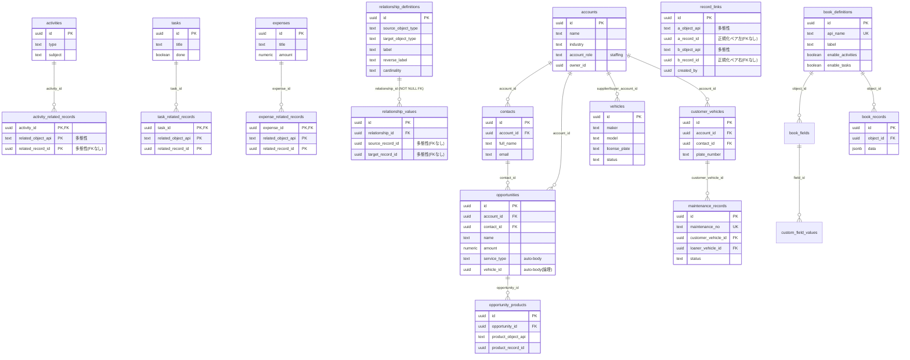

# Bract データモデル / ER 図（REQ-0078）

> 関連先（関連レコード）まわりのテーブル設計と、汎用リンク `record_links` 追加による変更点をまとめた生きたドキュメント。
> スキーマの一次ソースは [`src/lib/schema.ts`](../src/lib/schema.ts)。差異が出たら schema.ts を正とする。

---

## 0. 結論：テーブル設計はどう変わるか

**既存テーブルは一切変更しない**。汎用の双方向リンクを 1 本の新規テーブル `record_links` で追加するだけ。

| | 既存 junction (`*_related_records`) | 既存 `relationship_values` | **新規 `record_links`** |
|---|---|---|---|
| 何と何を結ぶ | 活動/ToDo/経費 → 任意レコード | 管理画面で定義した型ペアのレコード同士 | **任意レコード ↔ 任意レコード** |
| 起点の型 | activities / tasks / expenses に固定 | `relationship_definitions` に登録済みの型のみ | 制約なし（どの詳細ページからでも） |
| 事前定義 | 不要 | **必要**（`/admin/relationships` で型ペアを登録） | **不要**（即リンクできる） |
| 方向 | 起点→先の片方向 | 定義の向き（reverse_label で逆引き） | 双方向（A↔B を 1 行で表現） |
| 主キー | 複合 PK（起点id+型+先id） | `id` + unique(rel,源,先) | `id` + 正規化ペアの unique |

つまり「商談の詳細ページから物件にも車両にもカスタムレコードにも、定義なしでサッと関連付けたい」という REQ-0078 の要件を満たすのは `record_links` だけ。既存 2 系統はそのまま残す（役割が違うため）。

---

## 1. 関連付けの 3 系統（なぜ 3 つあるか）

Bract には「レコード同士を結ぶ」仕組みが歴史的に 3 系統ある。混同しやすいので役割を明記する。

### (A) `*_related_records` 系 junction（フォームの「関連先」）
`activity_related_records` / `task_related_records` / `expense_related_records`。
活動・ToDo・経費を作るときのフォームで「この活動はどのレコードに関する活動か」を複数選ぶための多態性 junction。
- 起点は activities / tasks / expenses の **3 つに固定**。
- 先は `related_object_api`(='account'|'contact'|'opportunity'|book api) + `related_record_id` の多態性参照。FK は張れない（削除時のクリーンアップはアプリ層）。

### (B) `relationship_definitions` + `relationship_values`（管理者が定義する関係）
`/admin/relationships` で「物件 ⇄ 商談（関連商談／関連物件）」のように **型ペアと表示名を事前定義** し、詳細ページに専用セクションとして出す仕組み。
- `relationship_values.relationship_id` は **NOT NULL の FK** で `relationship_definitions` を必ず指す。
- → **定義に無い型同士は結べない**。汎用リンクには使えない（これが record_links を新設する理由）。

### (C) `record_links`（新規・汎用双方向リンク）← REQ-0078 で追加
どの詳細ページからでも、事前定義なしで「任意のレコード ↔ 任意のレコード」を結ぶ。
- 統一検索ボックスの Picker（[`RelatedRecordsPicker`](../src/components/RelatedRecordsPicker.tsx)）をそのまま再利用。
- 既存 (A)(B) は撤去しない。(C) は「とりあえず関連付けたい」汎用導線として共存する。

---

## 2. `record_links` テーブル定義（提案）

```ts
export const record_links = pgTable('record_links', {
  id:               uuid('id').primaryKey().defaultRandom(),
  // 正規化したペア（a < b になるよう object_api:id 文字列で昇順整列して格納）
  a_object_api:     text('a_object_api').notNull(),
  a_record_id:      uuid('a_record_id').notNull(),
  b_object_api:     text('b_object_api').notNull(),
  b_record_id:      uuid('b_record_id').notNull(),
  created_by:       uuid('created_by'),
  created_at:       timestamp('created_at', { withTimezone: true }).defaultNow(),
}, (t) => [
  // 同じペアを二重登録させない（双方向を 1 行に正規化）
  unique('record_links_pair_uniq').on(t.a_object_api, t.a_record_id, t.b_object_api, t.b_record_id),
  // どちらの端からも引けるよう両側に index
  index('record_links_a_idx').on(t.a_object_api, t.a_record_id),
  index('record_links_b_idx').on(t.b_object_api, t.b_record_id),
])
```

設計ポイント：

1. **双方向を 1 行で表す**：`(a, b)` を `object_api:id` 文字列で昇順に正規化して必ず `a <= b` で格納する。これで「A→B」と「B→A」が同じ 1 行になり、重複と整合崩れを防ぐ。どちらの詳細ページから見ても `a_*` または `b_*` のどちらかに自分が居るので、両 index で OR 検索すれば相手が引ける。
2. **FK は張らない**：多態性（先が accounts/contacts/opportunities/book_records/vehicles… と複数テーブル）なので物理 FK 不可。削除時のクリーンアップは既存 junction と同じくアプリ層で行う。
3. **冪等マイグレーション**：`CREATE TABLE IF NOT EXISTS` + `CREATE INDEX IF NOT EXISTS` で全 Neon（dev / real-estate / auto-body）に適用（CLAUDE.md「全 Neon に全マイグレ」）。base 業種でも空のまま無害。

> 代替案として「正規化せず双方向 2 行を書く」案もあるが、重複・片側削除漏れのリスクが上がるため **正規化 1 行**を採用する。

---

## 3. ER 図（既存 + 新規）

関連付けの 3 系統とコアエンティティを中心に図示。設定系・板金業の明細系など周辺テーブルは省略（一次ソースは schema.ts）。



凡例：
- `多態性(FKなし)` … 先が複数テーブルに跨るため物理 FK を張れず、`*_object_api` + `*_record_id` の組で参照する列。削除整合はアプリ層。
- `PK,FK` / `PK` … 複合主キーの構成列。
- `staffing` / `auto-body` … 業種オーバーレイ列（base では未使用、nullable/default で無害）。

---

## 4. 実装範囲（record_links 追加で触る箇所）

| 種別 | 変更 | 既存/新規 |
|---|---|---|
| migration | `supabase/migrations/<ts>_record_links.sql`（冪等）を全 Neon に適用 | 新規 |
| schema | `src/lib/schema.ts` に `record_links` 追加 | 既存編集 |
| server action | add / remove / get（編集権限ゲート `canDo`）。削除時のリンク掃除フックも | 新規 |
| 共通 UI | `RecordLinksEditor`（インライン、[`RelatedRecordsPicker`](../src/components/RelatedRecordsPicker.tsx) を内包） | 新規 |
| 詳細ページ | 取引先/人物/商談/車両/カスタム各 detail に `RecordLinksEditor` を設置 | 既存編集 |
| 検索 API | [`/api/search/records`](../src/app/api/search/records/route.ts) は流用（変更なし） | 既存 |

検証ゲート（CLAUDE.md §4）：3 業種ビルド / `check:schema`（3 Neon）/ smoke / 業種ペア確認。

---

## 5. 関連

- REQ-0078（関連先 UI 統一 + 車両横断検索 + 汎用リンク）／ ADR-0023（検索 API RBAC）
- 既存統一 Picker: [`src/components/RelatedRecordsPicker.tsx`](../src/components/RelatedRecordsPicker.tsx)
- 検索 API: [`src/app/api/search/records/route.ts`](../src/app/api/search/records/route.ts)
